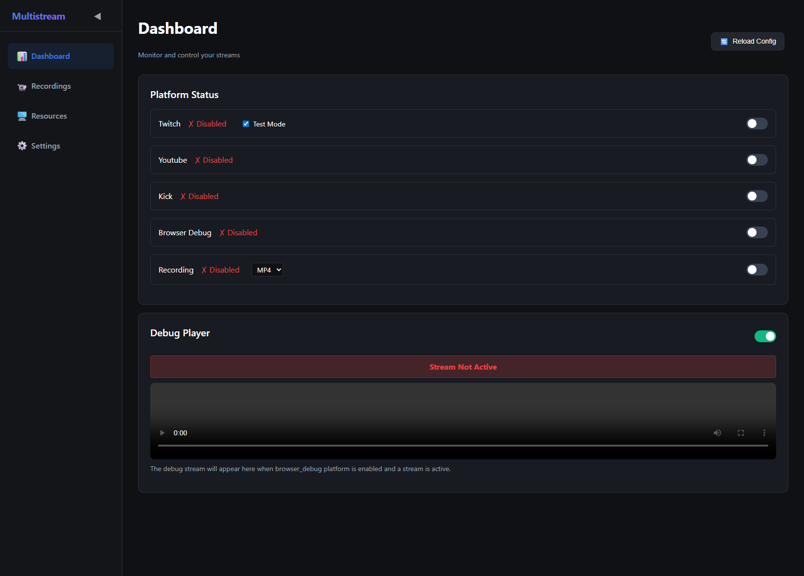
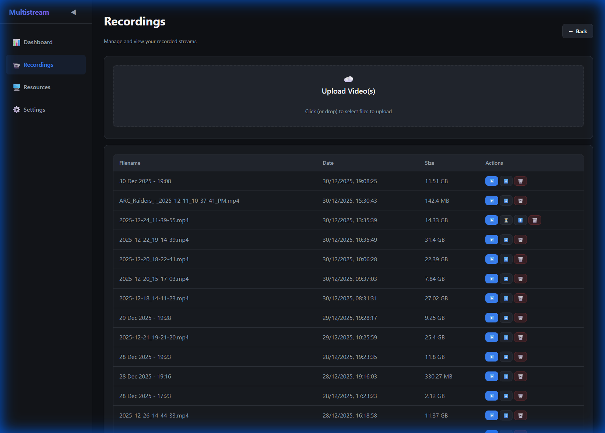
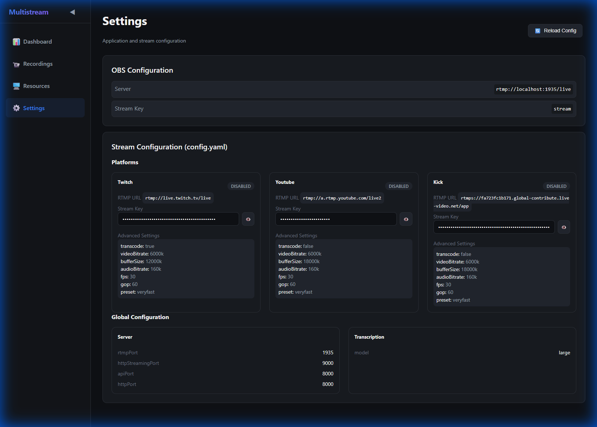
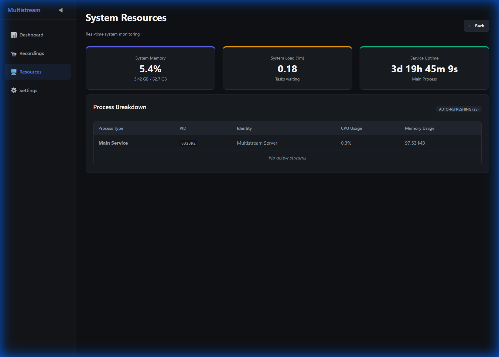

# Multistream Server

A Node.js RTMP server that receives streams from OBS and restreams them to multiple platforms simultaneously including Twitch, YouTube, Kick, and more.

## Features

- 📡 RTMP server to receive OBS streams
- 🔄 Simultaneous restreaming to multiple platforms
- 🎮 Support for Twitch, YouTube, Kick (easily extensible)
- 🌐 Web dashboard for monitoring
- 🐳 Docker support
- 🔧 Configuration via YAML file
- 🔍 Browser debug mode to preview streams in the dashboard

## Screenshots

### Dashboard


### Recordings


### Settings


### Resources


## Quick Start

### Using Node.js

1. **Install dependencies:**
   ```bash
   npm install
   ```

   Install ffpmeg.
   ```
   sudo apt install ffmpeg
   ```

   Install quill (for transcriptions).
   Check out [quill](https://github.com/cleanunicorn/quill) for more details.
   ```
   uv tool install . --python 3.12
   ```

2. **Configure your stream keys:**
   ```bash
   cp config.example.yaml config.yaml
   # Edit config.yaml with your stream keys
   ```

3. **Start the server:**
   ```bash
   npm start
   ```

4. **Configure OBS:**
   - Server: `rtmp://localhost:1935/live`
   - Stream Key: `stream`

5. **View dashboard:**
   Open `http://localhost:8000` in your browser

### Using Docker

1. **Create configuration:**
   ```bash
   cp config.example.yaml config.yaml
   # Edit config.yaml with your stream keys
   ```

2. **Run with Docker Compose:**
   ```bash
   docker-compose up -d
   ```

## Configuration

### YAML Configuration (config.yaml)

```yaml
platforms:
  twitch:
    enabled: true
    rtmpUrl: rtmp://live.twitch.tv/live
    streamKey: your_twitch_stream_key
    
  youtube:
    enabled: true
    rtmpUrl: rtmp://a.rtmp.youtube.com/live2
    streamKey: your_youtube_stream_key
    
  kick:
    enabled: false
    rtmpUrl: rtmps://fa723fc1b171.global-contribute.live-video.net/live
    streamKey: your_kick_stream_key

server:
  rtmpPort: 1935
  httpStreamingPort: 9000
  apiPort: 8000

recording:
  enabled: false
  path: ./recordings
  format: mp4
```

### Browser Debug Mode

The `browser_debug` platform allows you to preview your stream directly in the web dashboard. When enabled, you can view your stream at `http://localhost:8000` (or `http://YOUR_IP:8000` from other devices on your network) in the Debug Stream Player section. This is useful for:

- Testing your stream setup without going live
- Monitoring stream quality and latency
- Debugging encoding issues
- Viewing the stream from multiple devices (phones, tablets, other computers)

**Note**: The server will log your network IP addresses on startup for easy remote access.

## Adding Custom Platforms

Edit `config.yaml` to add new platforms:

```yaml
platforms:
  custom_platform:
    enabled: true
    rtmpUrl: rtmp://custom.platform.com/live
    streamKey: your_custom_key
```

## Development

```bash
npm run dev  # Run with nodemon for auto-reload
```

## Requirements

- Node.js 16+
- FFmpeg (automatically included in Docker image)

## API Endpoints

- `GET /` - Web dashboard
- `GET /health` - Health check
- `GET /api/config` - Get current configuration (without sensitive data)
- `GET /api/streams` - Get active streams

## License

MIT